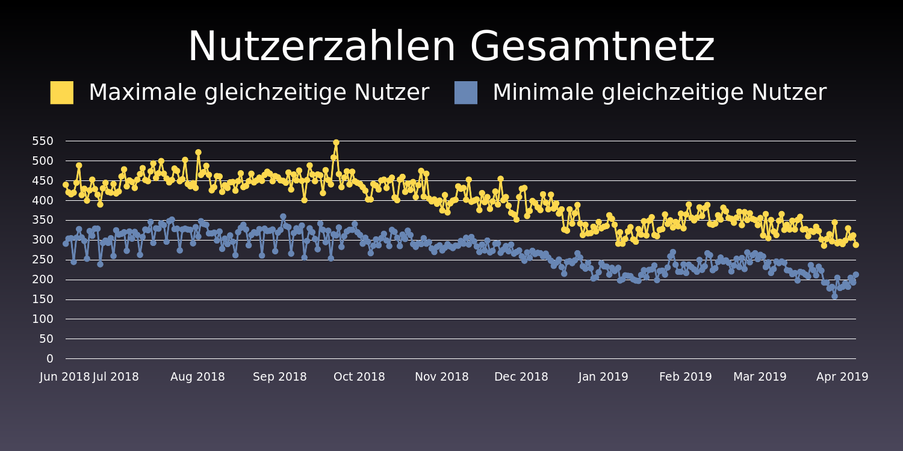
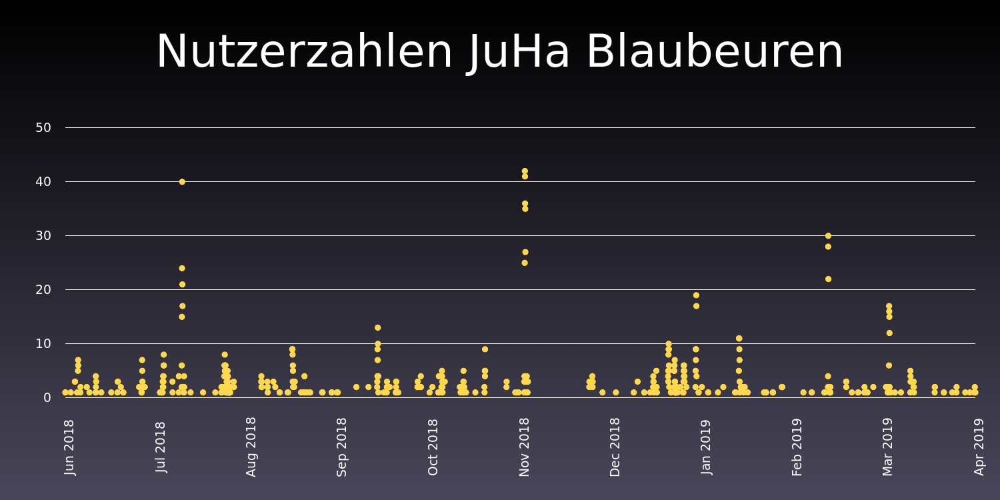

# Statistiken zum Ulmer Freifunk Netz

Allerdings nur über Nutzerzahlen. Quelle: API des Freifunk Ulm Netzes

## Nutzung des Ulmer Freifunknetzes

Das Ulmer Freifunknetz erfreut sich reger Nutzung: Zu fast keinem Zeitpunkt waren in den vergangenen Monaten weniger als 150 Clients gleichzeitig online, meistens nicht weniger als 200. Es gab keinen Tag an dem nicht zu mindestens einem Zeitpunkt über 250 Clients connected waren. Interessanterweise ging die Nutzeranzahl im Winter zurück und hat das Niveau des Sommers letzten Jahres nicht wieder erreichen können. Wer Theorien hat warum das so ist kann mir diese ja schreiben.

## Freifunk Nutzung im JuHa Blaubeuren

Wie Prometheus, der in der griechischen Legende das Feuer vom Olymp zu den Menschen trug, brachte ich vor einigen Jahren einen mit der Freifunk-Firmware geflashten Router ins Jugendhaus Blaubeuren. Aus diesem Grund ist es interessant für mich, wie stark das Freifunknetz von Besuchern des JuHas genutzt wird.

### Einige Beobachtungen:

- Größere Veranstaltungen stechen deutlich hervor. Beispiele sind Abiparties, die am 20.07.18 beziehungsweise am 09.11.18 stattgefunden haben, das "Boneyard Dog" Konzert am 04.01.19 oder Geburtage Mitte Januar und Anfang März.
- Auch die LAN-Party, die gegen Ende des Jahres 2018 stattgefunden hat, ist deutlich erkennbar. Hier ergab sich kein hoher Peak, sondern ein Zeitraum von einigen Tagen, in denen immer mehrere Personen mit dem Freifunk Netzwerk verbunden waren.
- Es scheint, als sei der Freifunk Router gegen Ende November für einige Tage ausgefallen.

Alles in allem denke ich, dass sich die Ausweitung des Freifunk Netzes auf's JuHa gelohnt hat. Es ist schade, dass es aus Kostengründen vermutlich in den nächsten Monaten abgeschaltet werden muss.
