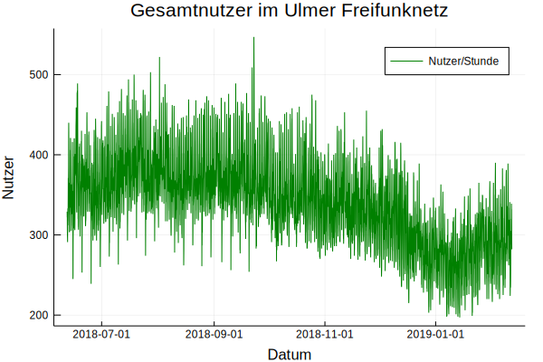

# Statistiken zum Ulmer Freifunk Netz

Allerdings nur über Nutzerzahlen. Daten werden täglich aktualisiert. Quelle: API des Freifunk Ulm Netzes

## Nutzung des Ulmer Freifunknetzes

Das Ulmer Freifunknetz erfreut sich reger Nutzung: Zu fast keinem Zeitpunkt waren in den vergangenen Monaten weniger als 200 Clients gleichzeitig online. Interessanterweise ging die Nutzeranzahl im Winter zurück und scheint seit Neujahr wieder zu steigen. Wer Theorien hat, warum das so ist, der kann sich ja bei mir melden :)

## Freifunk Nutzung im JuHa Blaubeuren

Wie Prometheus, der in der griechischen Legende das Feuer vom Olymp zu den Menschen trug, brachte ich vor einigen Jahren einen mit der Freifunk-Firmware geflashten Router ins Jugendhaus Blaubeuren. Aus diesem Grund ist es interessant für mich, wie stark das Freifunknetz von Besuchern des JuHas genutzt wird.

### Einige Beobachtungen:

- Größere Veranstaltungen stechen deutlich hervor. Beispiele sind eine Abiparty, die am 09.11.18 stattgefunden hat oder das "Boneyard Dog" Konzert am 04.01.19. Welches Event Mitte/Ende August stattfand, ist mir nicht bekannt. Der Peak, der in diesem Zeitraum zu erkennen ist, stammt vom 21.07.18, einem Dienstag. Sehr rätselhaft.
- Auch die LAN-Party, die gegen Ende des Jahres 2018 stattgefunden hat, ist deutlich erkennbar. Hier ergab sich kein hoher Peak, sondern ein Zeitraum von einigen Tagen, in denen immer mehrere Personen mit dem Freifunk Netzwerk verbunden waren.
- Es scheint, als sei der Freifunk Router gegen Ende November für einige Tage ausgefallen.

Alles in allem denke ich, dass sich die Ausweitung des Freifunk Netzes auf's JuHa gelohnt hat. Es ist schade, dass es aus Kostengründen vermutlich in den nächsten Monaten abgeschaltet werden muss.
