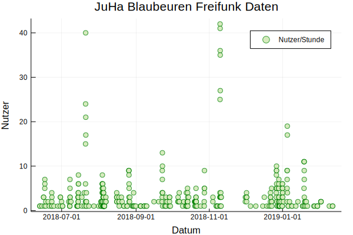

# Stats zum Ulmer Freifunk Netz

Allerdings nur über Nutzerzahlen. Daten werden täglich aktualisiert. Quelle: API des Freifunk Ulm Netzes

## Freifunk Nutzung im JuHa Blaubeuren

Wie Prometheus, der in der griechischen Legende das Feuer vom Olymp zu den Menschen trug, brachte ich vor einigen Jahren einen mit der Freifunk-Firmware geflashten Router ins Jugendhaus Blaubeuren. Aus diesem Grund ist es interessant für mich, wie stark das Freifunknetz von Besuchern des JuHas genutzt wird. 
